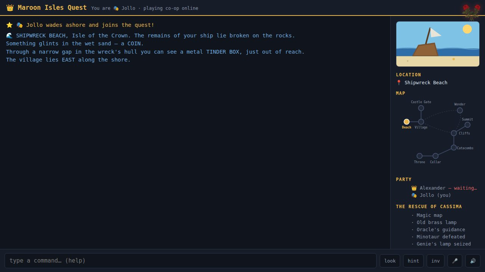

# Maroon Isles Quest

**Play it now: [quest.veered.org](https://quest.veered.org)** · more games at [veered.org](https://veered.org)



Maroon Isles Quest is a free two-player co-operative text adventure that runs in the
browser. One player is Alexander, the strong one; the other is Jollo, the small and
quick one. Some puzzles need one of you, some need both (`together <action>`). Scene
text can be read aloud, and commands can be spoken. Nothing to install, no account
needed.

## How it works

- **Server:** a Cloudflare Worker with Durable Objects (`src/`).
  - `Room`: one Durable Object per quest, addressed by `?g=<room>` on every `/api` call.
    It runs the game engine (`src/game.js`) and serves a long-poll event stream.
  - `Lobby`: one instance that matches arrivals to a quest with a free character.
    A quest already under way asks the player inside before letting a second one join.
  - `Stats`: one row per finished or abandoned quest, readable at
    `/api/stats?key=STATS_KEY&days=N`.
- **Client:** a single self-contained page (`public/index.html`). Scene art and the map
  are inline SVG. Voices use the browser's Web Speech API.

Type `help` in the game for the command list, and `newgame` to start over after a win.

## Run it yourself

Requires Node.js 22 or later.

```bash
npm install
cp .dev.vars.example .dev.vars   # optional
npx wrangler dev                 # then open http://localhost:8787 in two tabs
```

To deploy to your own Cloudflare account, run `npx wrangler deploy`. To serve it on
your own hostname, uncomment the `[[routes]]` block in `wrangler.toml`. The optional
`STATS_KEY` is set in production with `npx wrangler secret put STATS_KEY`.

## Credits and licenses

- Code: MIT. See [LICENSE](LICENSE).
- No third-party art, fonts or sound files are included. Scene illustrations are
  drawn in code, and speech uses the voices built into the browser.
- Maroon Isles Quest was written with AI assistance (Claude).
